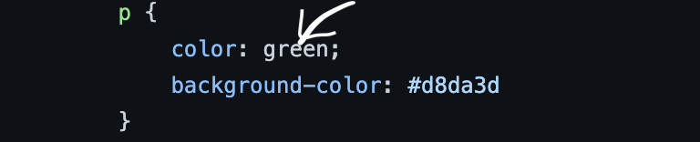

# Create a Jenkins instance that is running some jobs
## _Tools_

- AWS Cloud
- EC2 Instances
- Jenkins Server
- Docker 
- Github 
- Jenkinsfile
- Nginx

## _Overview_
This is to build up a very simple html website on this [github repo](https://github.com/gentitope/devopstest.git) and when commit to the main branch you can use jenkins server to deploy the application with Jenkinsfiles pipeline in [github repo](https://github.com/gentitope/devopstest/blob/main/Jenkinsfile).

## _Starting point_
The code is available on GitHub [github repo](https://github.com/gentitope/devopstest.git).
Jenkins-server: http://54.171.72.24:8080 (admin/admin)
Webserver: http://3.249.180.211/

## _To make some changes_
Edit index.html file in the repo [github repo](https://github.com/gentitope/devopstest.git) and change to the colour of your choice as seen the sceenshot below

